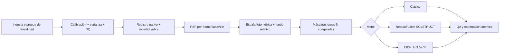

# Plan técnico de I+D: NebulaFusion y EIDR para cielo profundo

**Proyecto:** Zenith Astro Stacker  
**Fecha de investigación:** 12 de julio de 2026  
**Estado:** especificación técnica para implementación; no constituye evidencia de superioridad  
**Ámbito:** apilado de cielo profundo mono, RGB y OSC/CFA, preservando un máster científico lineal

## 0. Decisión ejecutiva

Se recomienda desarrollar dos motores distintos, porque maximizar la señal difusa y reconstruir detalle subpíxel son problemas relacionados, pero no equivalentes:

| Motor | Nombre de trabajo | Objetivo | Salida | Requisito dominante |
|---|---|---|---|---|
| Algoritmo 1 | **NebulaFusion** (`nebula_fusion_v1`) | Elevar SNR/CNR de nebulosidad y conservar el detalle disponible sin estirar ni enfocar el máster | Resolución nativa, float32 lineal, varianza/PSF/Neff; mapa STRUCT separado | Calibración y modelo de ruido fiables; no exige dither perfecto |
| Algoritmo 2 | **EIDR — Evidence-Informed Dither Reconstruction** (`eidr_v1`) | Reconstruir muestreo y detalle que estén realmente codificados en PSF+dithers | Grid 1x/1.5x/2x lineal, mapas de recuperabilidad, PSF y residuales | Dither independiente, registro subpíxel, PSF y varianza fiables |

La primera entrega comercial debe ser NebulaFusion. EIDR debe permanecer experimental hasta completar pruebas con verdad conocida y datos reales. Los dos motores compartirán calibración, máscaras, varianza, PSF, registro, telemetría y exportación, pero EIDR **no** debe procesar el máster producido por NebulaFusion: debe volver a los píxeles calibrados nativos.

La innovación defendible no es “inventar información”, sino combinar:

1. fusión lineal por escala con pesos independientes del brillo del objeto;
2. validación de estructuras en mitades independientes;
3. un modelo directo detector→escena que incluye warp, PSF, área de píxel y CFA;
4. una puerta local que calcula qué frecuencias son recuperables y bloquea las demás;
5. diagnósticos que permiten auditar cada ganancia de detalle.

No debe publicarse que estos métodos son científicamente nuevos, patentables o superiores sin una búsqueda formal de anterioridad y el benchmark definido aquí. Son una propuesta de ingeniería original para Zenith construida sobre trabajos publicados.

## 1. Qué significa “recuperar” señal y detalle

### 1.1 Imagen lineal

Una imagen lineal conserva una relación afín entre señal registrada y valor de píxel. Puede contener normalización fotométrica, calibración, registro, combinación robusta e incluso un estimador inverso; no puede contener un stretch, curva gamma, HDR tonal, CLAHE, LocalHistogramEqualization, deconvolución oculta ni contraste local aplicado sin declararlo.

Reglas obligatorias:

- El máster científico será `float32`; los acumuladores y reducciones críticas usarán `float64` o suma compensada.
- Se conservarán valores negativos surgidos de la calibración y headroom por encima del rango original.
- Nunca se hará clamp a cero durante calibración, integración o reconstrucción.
- La positividad será `off` por defecto. Solo podrá activarse cuando el cero físico esté determinado y quedará registrada.
- STF, stretch y “contraste de estructura” serán vistas de pantalla o exportaciones explícitamente no lineales, nunca el máster.
- L, R, G, B, Ha, OIII, SII y cada filtro se integrarán por separado. La combinación de canales será una etapa posterior.

### 1.2 Qué sí se puede recuperar

- Señal débil repetida coherentemente entre exposiciones, reduciendo la varianza.
- Frecuencias subpíxel que estén muestreadas por offsets de dither independientes.
- Detalle que quedó atenuado por la mezcla de tomas con seeing diferente, usando PSF y ruido medidos.
- Mejor separación visual señal/ruido mediante un mapa de significancia, sin alterar el máster.

### 1.3 Qué no se puede recuperar de forma honesta

- Frecuencias por encima del soporte óptico/atmosférico o no muestreadas por el dither.
- Estructuras que aparecen en una sola mitad de los datos o que no predicen exposiciones reservadas.
- Color inexistente en una CFA con cobertura insuficiente por canal.
- Nebulosidad confundida con un modelo de fondo demasiado flexible.

## 2. Fundamento científico y conclusión de la investigación

Drizzle conserva fotometría y maneja distorsión, máscaras y dithers, pero su depósito de “gotas” no invierte la PSF ni la respuesta del píxel; además introduce ruido correlacionado. Lauer mostró que los modos aliasados pueden separarse si el patrón de dither tiene rango suficiente. iDrizzle añadió ciclos de proyección/residual y filtrado limitado en banda. IMCOM formalizó el compromiso entre fidelidad a una PSF objetivo y amplificación de ruido. Proper Coaddition mostró cómo combinar PSF y ruido por frecuencia bajo hipótesis de fondo gaussiano. Más recientemente, ImageMM demostró restauración y superresolución astronómica multi-frame robusta en GPU, y Effortless/Fast IMCOM avanzaron el control eficiente de PSF.

Dos límites de la literatura condicionan el diseño:

- Un coadd solo mantiene una PSF bien definida si las PSF de entrada coinciden o si sus pesos no dependen de la señal del objeto. Por ello Zenith no debe usar brillo, gradiente de nebulosa o “cantidad de detalle observado” como peso del máster.
- Los resultados más recientes de Effortless, publicados el 7 de julio de 2026, se basan principalmente en simulaciones Roman y fuentes puntuales ideales con PSF conocida. El propio trabajo deja para validación futura las fuentes extendidas ruidosas y las PSF desconocidas. No es evidencia directa para fotografía de cielo profundo terrestre.

Consecuencia: NebulaFusion empleará únicamente ruido, exposición, máscara, transparencia y PSF medida para decidir los pesos. El mapa de estructura puede depender de la señal, pero se exportará separado y no realimentará el máster. EIDR usará un modelo físico no generativo, con regularización limitada por recuperabilidad y validación fuera de muestra.

## 3. Auditoría de la base actual

### 3.1 Capacidades reutilizables

El repositorio actual es Tauri + Rust + Vite/JavaScript. Ya dispone de:

- lectura FITS/TIFF a `f32` y preservación de negativos/headroom;
- calibración bias/dark/flat antes del debayer;
- CFA identificado por `BAYERPAT` y Drizzle CFA sin debayer previo;
- detección estelar, ajuste PSF, FWHM, ruido y excentricidad;
- registro similarity/affine/projective/local con RANSAC;
- normalización aditiva, de escala y local;
- sigma, Winsorized, linear-fit y otros rechazos CPU/GPU;
- almacenamiento RAM/mmap/LZ4 y telemetría;
- Drizzle clásico mono/RGB/CFA por depósito geométrico;
- máster FITS float32 y mapas de cobertura, peso, rechazo y residuales.

Puntos de entrada actuales:

- contrato tipado: `src-tauri/src/pipeline.rs`, `DeepSkyStackRequest`;
- preflight: `src-tauri/src/deepsky.rs`, `prepare_deepsky_stack`;
- acumulación warp: `ds_warp_accumulate`;
- Drizzle: `ds_drizzle_accumulate` y `ds_drizzle_cfa_accumulate`;
- primer peso local: bloque `wq_fields`;
- selección de motor: bloque de integración posterior a normalización;
- GPU: `src-tauri/src/gpu_deepsky.rs`;
- solicitud y revisión de UI: `src/main.js`, flujo Deep Sky.

### 3.2 Estado real del “Rescate de detalle” existente

La bandera `local_weighting` y su rejilla FWHM 8x8 son un prototipo, no el algoritmo 1 terminado:

- usa casi exclusivamente FWHM local;
- funciona en CPU streaming y Drizzle CPU, pero no en tiled/Winsorized ni GPU;
- la prevalidación puede anunciar una ruta que después ignora el peso;
- no queda registrada en la receta exportada ni dispone de UI completa;
- no propaga varianza, `Neff` ni PSF efectiva;
- no valida campos de peso reales en las pruebas.

Debe conservarse como experimento de referencia y sustituirse por una configuración versionada. No debe activarse silenciosamente en `MaximumQuality` antes de tener paridad y pruebas fotométricas.

### 3.3 Deuda bloqueante antes de los nuevos motores

1. El árbol de trabajo parte de `main`/`e98e2f7` y contiene unas 16.7k líneas cambiadas sin commit. Congelar un baseline reproducible es requisito de gestión, no una autorización para alterar cambios del usuario.
2. `deepsky.rs` supera 9,400 líneas y `main.js` 11,800. Los motores nuevos deben nacer en módulos separados; no se recomienda una reescritura total previa.
3. Existe un resultado y una cancelación global. EIDR necesita `JobRegistry` y token de cancelación por trabajo.
4. PNG/JPEG se admiten sin probar linealidad; deben quedar fuera de los dos motores científicos.
5. El probe de formatos no FITS puede declarar RGB aunque el loader entregue mono.
6. FITS con `NAXIS3=2` puede entrar en una rama que presupone tres planos. Debe validarse y rechazarse de forma segura.
7. El Drizzle actual rellena huecos sin cobertura dentro de `final_data`. En los nuevos motores, los huecos científicos permanecerán enmascarados/NaN; el relleno se limitará a preview.
8. El rechazo per-pixel actual cae a sigma cuando se usa Drizzle. Las máscaras de outlier deben convertirse en un producto común anterior a ambos algoritmos.
9. La documentación de pruebas está desactualizada. La auditoría actual ejecutó 108 pruebas correctas y dejó 18 ignoradas, principalmente de GPU física.

## 4. Contrato de datos científico común

### 4.1 Tipos internos propuestos

```rust
enum SampleLayout {
    Mono,
    RgbInterleaved,
    Cfa { pattern: CfaPattern, x_offset: u8, y_offset: u8 },
}

enum VarianceOrigin {
    Propagated,
    CameraModel,
    Empirical,
}

struct LinearFrame {
    pixels: FrameStoreHandle,       // f32, unidades declaradas
    variance: VarianceStoreHandle,  // f32, mismas unidades al cuadrado
    dq_mask: MaskStoreHandle,       // bitmask, no solo bool
    width: usize,
    height: usize,
    layout: SampleLayout,
    unit: SignalUnit,
    exposure_s: f32,
    gain_e_per_adu: Option<f32>,
    saturation_adu: Option<f32>,
    photometric_scale: f32,
    background_offset: f32,
    transform: DsTransform,
    psf_field: PsfField,
    provenance: FrameProvenance,
}
```

Bits mínimos de `dq_mask`: saturado, no lineal, blooming, hot/cold, cosmic, satélite, borde/gap, NaN/Inf, flat inválido, interpolado de entrada y sin cobertura.

### 4.2 Calibración y propagación de varianza

Sea `n = R - B - kD` y `f` el flat maestro normalizado a uno:

\[
S=\frac{n}{f},
\qquad
\operatorname{Var}(S)\approx
\frac{V_R+V_B+k^2V_D}{f^2}
+\frac{n^2V_f}{f^4}.
\]

Requisitos:

- Crear no solo cada máster de calibración, sino su mapa de varianza y número efectivo de muestras.
- Si existen gain/read-noise/offset fiables, modelar shot noise + read noise + dark noise en electrones.
- Si faltan metadatos, estimar ruido empírico por canal/CFA y marcar `VarianceOrigin::Empirical`; no inventar electrones.
- Propagar la escala fotométrica: `V'_i = g_i^2 V_i`.
- En dark con amp glow no escalar el patrón térmico como si fuera lineal sin prueba.
- Saturación y zona no lineal se enmascaran antes del registro y no se corrigen mediante clipping.
- Flats, darks y bias deben agruparse por geometría, CFA, gain, binning, temperatura, exposición/filtro y sesión según corresponda.

### 4.3 Normalización y fondo

La normalización debe resolver dos parámetros distintos:

- `g_i`: escala de flujo por exposición, estimada con estrellas no saturadas mediante regresión robusta;
- `b_i`: fondo aditivo, medido en regiones válidas.

Para evitar que una sola referencia imprima su ruido, NebulaFusion debe poder resolver offsets relativos como un grafo:

\[
\min_{b}\sum_{(i,j)}\omega_{ij}
\left[(b_i-b_j)-d_{ij}\right]^2,
\qquad \sum_i b_i=0.
\]

El ajuste espacial automático es peligroso: un plano o spline de fondo puede ser indistinguible de nebulosidad extensa. Valor por defecto:

- banda ancha/estrecha: solo offset global y escala fotométrica;
- plano de primer orden: opcional, exige máscara de objeto y validación split-half;
- modelo local flexible: desactivado para nebulosa oscura/extensa salvo acción explícita;
- ABE/SCNR: siempre fuera del benchmark y del máster científico.

### 4.4 Registro y PSF

- Guardar transformaciones sobre el frame nativo; no depender únicamente de imágenes ya remuestreadas.
- Guardar covarianza/incertidumbre del registro y RMS local, no solo el transform final.
- Ajustar PSF Moffat elíptica como mínimo; después permitir mezcla gaussiana o base PCA pequeña.
- Rechazar estrellas saturadas, mezcladas o con vecinos; reservar 20% de estrellas para validar refinamientos.
- El campo PSF se modelará en tiles con variación suave y bajo número de parámetros.
- Para color, PSF por canal; para CFA, considerar offsets y respuesta por color.

## 5. Matriz de formatos y linealidad

| Formato | Entrada en motores nuevos | Requisitos | Prioridad |
|---|---|---|---|
| FITS `.fit/.fits` | Sí, principal | `BITPIX`, `BSCALE/BZERO`, NaN/BLANK, NAXIS y orden de canales correctos; mono/RGB/CFA; preservar header | P0 |
| TIFF 16-bit entero | Sí, condicionado | Debe declararse lineal; sin gamma/ICC de display; mono/RGB conocido | P0 |
| TIFF 32/64-bit float | Sí | Preservar negativos, `SampleFormat`, rango y canales; no inferir 0..1 solo por máximo sin metadata/heurística auditada | P0 |
| XISF float32 | Sí, futuro | Geometría, sample format, color space, propiedades FITS y compresión lossless | P2 |
| DNG/CR2/CR3/NEF/ARW | Sí, futuro | LibRaw/DNG SDK; extraer mosaico nativo, black/white level y CFA; sin WB, gamma, denoise ni demosaic | P3 |
| SER mono/CFA 16-bit | Opcional | Exposición/gain estables y metadatos/sidecar; reutilizar `FrameSource` | P3 |
| PNG 16-bit | No científico | Solo preview/importación heredada; gamma/color pueden ser ambiguos | P0: bloquear elegibilidad |
| JPEG/PNG 8-bit | No | Pérdida, gamma y cuantización incompatibles | P0: bloquear elegibilidad |

El preflight devolverá `scientificEligible`, `linearityEvidence` y `linearityWarnings` por archivo/grupo. “La extensión parece TIFF” no prueba linealidad.

### 5.1 Exportación científica

Primera implementación: archivos FITS separados y atómicos para simplificar compatibilidad.

- `*_SCI.fits`: máster lineal float32.
- `*_VAR.fits`: varianza.
- `*_IVAR.fits`: inverse variance/peso.
- `*_COVERAGE.fits`: cobertura geométrica/efectiva.
- `*_COVKERNEL.fits` o `*_NOISEPSD.fits`: covarianza local o PSD cuando corresponda.
- `*_NEFF.fits`: número efectivo de muestras.
- `*_DQ.fits`: máscara de calidad.
- `*_PSF.fits` o JSON: FWHM/elipticidad/MTF por tile.
- `*_STRUCT.fits`: significancia/soporte, nunca confundido con SCI.
- EIDR añade `*_RECOV.fits` y residuales por exposición/tile.

Segunda implementación: FITS multi-extension o XISF con los mismos productos. Metadatos mínimos: algoritmo/versión, unidad, escala, linealidad, parámetros solicitados y efectivos, hash de fuentes, PSF objetivo/efectiva, iteraciones, regularización, fallback, semilla y `HISTORY`.

## 6. Algoritmo 1 — NebulaFusion: SCI + STRUCT

### 6.1 Objetivo y contrato

NebulaFusion debe producir dos resultados claramente distintos:

- **`SCI`**: máster científico de resolución nativa, radiométricamente lineal, con PSF objetivo, función de transferencia y covarianza/PSD conocidas. Es el resultado que se exporta por defecto.
- **`STRUCT`**: reconstrucción de evidencia multiescala en las mismas unidades que `SCI`, pero no es un estimador lineal porque el soporte se selecciona a partir de los datos. Sirve para inspección, máscara o rama estética; nunca sustituye a `SCI`.

Esto resuelve la petición de nebulosas débiles, detalle y contraste sin esconder un stretch. `SCI` maximiza la información y SNR dentro del modelo; `STRUCT` permite visualizar únicamente las estructuras que reaparecen en particiones independientes. El preview podrá mostrar STF/asinh de cualquiera de ellos, siempre rotulado como no lineal.

`SCI` conserva la escala lineal de intensidades. El operador final solo es matemáticamente lineal una vez congelados PSF, escalas, fondo y máscaras; como esos elementos se estiman de los datos, la receta debe guardar sus valores y su procedencia.

### 6.2 Modelo

Para un tile aproximadamente estacionario y una exposición `i` ya calibrada, registrada y normalizada:

\[
Y_i(k)=\alpha_i H_i(k)X(k)+B_i(k)+N_i(k),
\]

donde `H_i` incluye PSF efectiva y respuesta de píxel/remuestreo, `alpha_i` es la escala fotométrica y `S_i(k)` es la PSD de ruido de fondo, lectura y calibración. El flujo Poisson del objeto se usa para estimar incertidumbre final, pero **no** para decidir pesos de `SCI`.

Se acumulan:

\[
Q(k)=\sum_i\frac{\alpha_i H_i^*(k)[Y_i(k)-B_i(k)]}{S_i(k)},
\]

\[
D(k)=\sum_i\frac{\alpha_i^2|H_i(k)|^2}{S_i(k)}.
\]

Para una PSF objetivo `Gamma`, con `Gamma(0)=1`:

\[
\boxed{SCI(k)=\Gamma(k)\frac{Q(k)}{D(k)}}
\]

\[
\boxed{PSD_{SCI}(k)=\frac{|\Gamma(k)|^2}{D(k)}}.
\]

Si `D(k)` carece de rango o cae bajo el umbral de información, esa frecuencia se atenúa y se marca; no se divide por un número arbitrariamente pequeño. Esta forma GLS por frecuencia usa todas las tomas de bajo ruido en escalas grandes y deja que las mejores PSF aporten las frecuencias finas, sin homogeneizar todo a la peor exposición.

Como producto de detección opcional:

\[
F_R=\sqrt{D(0)},\qquad
DET(k)=\frac{Q(k)}{F_R\sqrt{D(k)}}.
\]

Su respuesta efectiva es `sqrt(D)/F_R` y el ruido es aproximadamente blanco cuando se cumplen las hipótesis. `DET` no reemplaza `SCI` ni conserva necesariamente sus unidades.

### 6.3 Caso general con máscaras, distorsión o PSF variable

Cuando el tile no sea estacionario, los pesos del píxel de salida `q` se obtendrán con una forma local de combinación PSF-objetivo:

\[
t_q^\star=\arg\min_t
\left\|A^Tt-\gamma_q\right\|_{W_\Omega}^2
+\kappa\,t^T C_{bg}t,
\]

sujeto a conservación DC:

\[
(A^Tt_q^\star)^T\mathbf{1}=1.
\]

Entonces:

\[
SCI_q=t_q^{\star T}(y-B\hat\beta),
\qquad
C_{SCI}=T C_{full}T^T.
\]

El MVP no intentará resolver este sistema por cada píxel de una imagen completa. Se usará la ruta FFT por tiles y se caerá al solver local solo en bordes, máscaras densas o tiles que no cumplan estacionariedad. En una segunda optimización, kernels por clase de fase subpíxel y tile reutilizarán los pesos.

### 6.4 Selección de la PSF objetivo

1. Ajustar ePSF por frame/canal, inicialmente Moffat elíptica; incluir respuesta de píxel.
2. Proponer una Moffat/Gauss circular con FWHM del percentil 20 de las tomas aceptadas.
3. Ensanchar `Gamma` hasta cumplir simultáneamente:
   - fuga PSF `U/C <= 1e-3`;
   - amplificación de varianza `<= 1.5` respecto al coadd GLS nativo;
   - al menos 2.2 píxeles de salida por FWHM;
   - cobertura y `Neff` válidos en el 95% del área científica.
4. Si no existe una `Gamma` factible, usar combinación GLS sin recuperación de frecuencia y explicar el fallback.

Reglas iniciales de PSF:

- menos de 8 estrellas válidas: desactivar PSF-aware y usar pesos de fondo;
- 8–29: PSF constante por frame/canal;
- 30–79: variación espacial lineal;
- 80 o más: orden espacial 2, condicionado por validación;
- estrellas entre 20% y 80% del full well, aisladas y no saturadas.

### 6.5 Rechazo cross-fit congelado

El clipping directo confunde núcleos estelares submuestreados con outliers y hace que la PSF dependa del objeto. NebulaFusion debe producir las máscaras antes de la combinación final:

1. Estratificar frames por tiempo, dither, exposición y calidad en 2–5 folds.
2. Para cada fold, crear un piloto sin sus frames.
3. Proyectar el piloto a cada detector/registro y formar el residual normalizado:

\[
r_{ip}=\frac{y_{ip}-\hat y_{ip}}
{\sqrt{V_{ip}+V_{pred}+V_{reg}+V_{PSF}}}.
\]

4. Estimar probabilidad de inlier con una mezcla Gauss + Student-t.
5. Congelar máscara si `P(inlier|r)<0.01` y `|r|>5`; crecer componentes conectados, columnas y trazas.
6. No sustituir el píxel rechazado: se enmascara y se reduce cobertura.

Valores iniciales:

- semilla 5 sigma; vecinos 3.5 sigma;
- crecimiento máximo `max(1 px, 0.5 FWHM)`;
- `N<5`: solo máscaras estáticas/cosmética conservadora;
- `5<=N<8`: leave-one-out a 5.5 sigma;
- `N>=8`: folds estratificados y PSD empírica.

El mapa debe guardar causa, probabilidad y número de rechazos. Las máscaras quedan fijas durante `SCI`; modificar pesos con el brillo del objeto invalidaría la PSF declarada.

### 6.6 PSD de ruido y tiles

- Tile inicial: 512x512, halo/solape 128, ventana sqrt-Hann y suma por partición de unidad.
- Auto-tile: al menos 16 FWHM por lado y variación de PSF estimada menor a 2%.
- Estimar PSD desde residuales temporales o diferencias de frames, nunca desde un único frame que pueda contener nebulosidad.
- Con `N<8`, usar modelo analítico blanco + filas/columnas medidas y marcar menor confianza.
- Corregir la PSD por cualquier interpolación de registro; no tratar píxeles remuestreados como independientes.
- Para grandes campos, interpolar suavemente PSD y PSF entre tiles; exportar la rejilla efectiva.

Implementación CPU propuesta: `rustfft`/`realfft`, buffers reutilizables y streaming desde `FrameStore`. La GPU llegará después de la referencia CPU y puede usar filtros espaciales para PSF compacta o FFT overlap-save propia; no se añadirá una dependencia CUDA que rompa Metal/wgpu.

### 6.7 Construcción de STRUCT

Crear dos `SCI` independientes, `s_A` y `s_B`, equilibrados por noche, exposición y fase de dither. Para un átomo multiescala `d_m`:

\[
z_{m,h}=\frac{d_m^Ts_h}{\sqrt{d_m^TC_hd_m}},
\qquad h\in\{A,B\}.
\]

El soporte acepta un coeficiente solo si:

- pasa Benjamini–Hochberg FDR `q=0.01` en ambas mitades;
- tiene el mismo signo en ambas;
- `min(|z_A|,|z_B|) >= 2.5`.

Después se refitan amplitudes para reducir el sesgo del threshold:

\[
a_S^\star=\arg\min_a
\frac12(s-D_Sa)^TC_s^{-1}(s-D_Sa)
+\frac{\epsilon}{2}\|L_Sa\|^2,
\]

\[
STRUCT=D_Sa_S^\star,
\qquad RESIDUAL=SCI-STRUCT.
\]

Orden de implementación:

- V1: starlet no diezmada a escalas 1, 2, 4, 8, 16, 32, 64 y 128 px; DC/escala más gruesa sin umbral.
- V2: curvelets en cuatro escalas para filamentos, solo después de validar memoria/licencia/implementación.
- Sin positividad; `epsilon=1e-4` relativo a la diagonal media; PCG residual relativo `1e-5`, máximo 200.
- `N<16`: ocultar `STRUCT` por defecto; una división 8/8 es el mínimo operativo inicial.

`STRUCT` puede omitir señal real bajo el umbral o seleccionar coincidencias de ruido. La UI mostrará siempre `SCI`, `STRUCT`, `RESIDUAL` y la concordancia A/B.

### 6.8 Mono, RGB, CFA y HDR

- Mono y cada filtro: resolver de forma independiente.
- RGB lineal: escala, PSF y PSD por canal; la geometría se comparte.
- Para evitar cambios de color, ninguna métrica de luminancia transferirá detalle entre canales.
- RGB ya demosaico se admite, pero se marca la covarianza espacial/intercanal desconocida si no se conoce el interpolador.
- OSC/CFA final: usar selector R/G1/G2/B en el operador; no debayer antes. G1/G2 son el mismo canal físico con offsets/calibraciones auditables.
- Primera beta puede admitir OSC mediante el debayer float32 actual, pero no podrá reclamar la calidad del modo CFA y se rotulará `demosaiced_input=true`.
- Exposiciones HDR: píxeles sobre el límite de linealidad se enmascaran; las exposiciones cortas reconstruyen núcleos. Como cambia el conjunto de frames, exportar `HDR_LOCAL_PSF` y cobertura de saturación.

### 6.9 Parámetros y degradación segura

Configuración inicial:

```rust
struct NebulaFusionConfig {
    version: u16,
    mode: NebulaFusionMode,       // Science | ScienceAndStruct
    tile_size: u16,               // auto, base 512
    target_psf: TargetPsfPolicy,  // Auto | Fixed
    max_psf_leakage: f32,         // 1e-3
    max_noise_amplification: f32, // 1.5
    empirical_psd: bool,
    crossfit_rejection: bool,
    fdr_q: f32,                   // 0.01
    min_split_sigma: f32,         // 2.5
}
```

Fallbacks explícitos:

- sin PSF suficiente -> GLS por ruido, PSF no controlada;
- sin PSD fiable -> modelo analítico;
- máscara/variación excesiva -> solver local o integración clásica;
- `Neff<2` -> advertir y ensanchar PSF; nunca ocultar dominancia de un frame;
- fondo degenerado con nebulosa -> congelar solo offset global;
- fallo GPU -> reiniciar el pase completo en CPU, no mezclar tiles de distinta precisión;
- cancelar/disco lleno -> no publicar artefactos parciales.

### 6.10 Criterios de aceptación de NebulaFusion

- Pendiente flujo inyectado `1 +/- 0.005`; no linealidad máxima <1% fuera de saturación.
- Flujo difuso: sesgo <2% a SNR>=5 y <5% a SNR 2–5.
- Transferencia dentro de la banda declarada entre 0.98 y 1.02.
- SNR por escala >=98% del óptimo GLS simulado.
- Fuga PSF <=1e-3 y error de energía encerrada <1%.
- Desviación de residuales normalizados entre 0.95 y 1.05.
- Error de ruido de apertura <5% entre aperturas de 1 a 128 px.
- Precisión de rechazo >99%, recall >95% y falso rechazo de píxeles limpios <1e-4.
- Costura residual de fondo <0.2 sigma por elemento de resolución.
- Sesgo de cocientes de canal <1%.
- CPU/GPU: RMSE <=0.5 ADU y mismos mapas/fallbacks dentro de tolerancia.
- Con modo desactivado, resultado clásico bit-idéntico o con tolerancia cero documentada.

## 7. Algoritmo 2 — EIDR, sucesor físico de Drizzle

### 7.1 Diferencia esencial respecto a Drizzle

Drizzle empuja cada píxel como una gota sobre un grid fino. EIDR realiza el camino inverso: propone una escena de alta resolución, la proyecta a cada detector nativo mediante el modelo óptico/sensor, compara la predicción con el dato y retroproyecta los residuales con el adjunto exacto.

No se crean frames registrados intermedios para el solver. El grid 2x es solo el espacio de hipótesis; la puerta de recuperabilidad decide qué frecuencias del grid contienen evidencia y cuáles son mera interpolación.

### 7.2 Modelo directo

Para exposición `i`, canal `c` y píxel detector `p`:

\[
y_{icp}=g_{ic}[A_{ic}(\theta_i,\psi_{ic})x_c]_p
+[B_i\beta_{ic}]_p+\epsilon_{icp},
\]

\[
A_{ic}=C_{ic}D_iP_iH_{ic}(\psi_{ic})W_i(\theta_i).
\]

- `x_c`: escena latente en el grid de salida.
- `W_i`: traslación, rotación, escala y distorsión.
- `H_i`: PSF óptica+atmosférica+guiado, variable por región/canal.
- `P_i`: integración de área y respuesta intrapíxel.
- `D_i`: muestreo del detector.
- `C_i`: selector CFA, identidad en mono/RGB.
- `g_i`: escala fotométrica.
- `B_i beta_i`: fondo residual constante o plano.
- `M_i,V_i`: máscara y varianza.

### 7.3 Función objetivo

Modo de detalle restringido:

\[
\begin{aligned}
\min_{x,\theta,\psi,g,\beta}\quad
&\sum_{i,c,p}m_{icp}\,
\rho_\delta\!\left(
\frac{y_{icp}-g_{ic}[A_{ic}x_c]_p-[B_i\beta_{ic}]_p}
{\sqrt{v_{icp}}}
\right)\\
&+\lambda_T TGV^2_{\alpha,D_s}(x)
+\lambda_F\sum_{\tau,k}\omega_{\tau k}|\widehat{x_\tau}(k)|^2\\
&+R_\theta(\theta-\hat\theta)+R_\psi(\psi-\hat\psi).
\end{aligned}
\]

- Huber `delta=2.5–3 sigma` reduce outliers después de comparar contra el modelo directo.
- TGV de segundo orden protege bordes y gradientes suaves sin el staircasing de TV.
- `D_s` se calcula una vez desde el piloto y su anisotropía se limita inicialmente a 4:1.
- Los priors de registro y PSF impiden una solución ciega libre.
- La regularización se elige por principio de discrepancia: los residuales deben concordar con el ruido, no con una preferencia estética.

Debe existir además `EidrSolveMode::ScientificQuadratic`, con máscaras/PSF/registro congelados, pérdida L2 y regularización cuadrática. Para parámetros fijos su solución es un operador lineal y será la referencia científica/primera release. Huber+TGV permanecerá `ExperimentalDetail` hasta validar falsos positivos.

### 7.4 Puerta local de recuperabilidad

Para tile `tau`, frecuencia base `k` y réplica aliasada `ell`:

\[
Q_{\tau,k}(i,\ell)=
\frac{\widehat h_{i,\tau}(k+\ell f_s)
e^{-2\pi i(k+\ell f_s)\cdot\Delta_{i,\tau}}}
{\sigma_{i,\tau}}.
\]

La SVD de esta matriz mide:

- rango numérico de los modos aliasados;
- `sigma_min`, evidencia del modo peor determinado;
- condición `kappa=sigma_max/sigma_min` y amplificación potencial de ruido;
- recuperabilidad local/frecuencial:

\[
R_{\tau,k}=\frac{\widetilde\sigma_{min}^2}
{\widetilde\sigma_{min}^2+\eta}.
\]

Las bandas sin rango se eliminan mediante un taper continuo y se reportan; ningún prior completa textura. Umbrales iniciales, pendientes de calibración:

- `kappa <= 30`: apto;
- `30 < kappa <= 100`: degradar cutoff/ensanchar PSF;
- `kappa > 100` o pérdida de rango: fallback local a menor escala o 1x.

Tiles: 256–512 píxeles nativos, PSF/Jacobiano en centro y esquinas, 32–64 bins radiales/angulares y blending por partición de unidad.

### 7.5 Flujo operativo

1. **Preflight científico:** linealidad, máscaras, varianza, PSF, registro y memoria.
2. **Piloto conservador:** Drizzle actual con pixfrac 0.7–1 o NebulaFusion; solo inicialización/fallback.
3. **Evaluar 1x/1.5x/2x:** construir la puerta por tile/frecuencia. 3x queda fuera del MVP.
4. **Solver con parámetros fijos:**
   - PCG para `ScientificQuadratic`;
   - IRLS exterior + PDHG/Chambolle–Pock para Huber+TGV.
5. **Microregistro:** Gauss–Newton/LM sobre traslación, rotación y escala, límite inicial +/-0.2 px nativo.
6. **PSF acotada:** Moffat/mezcla gaussiana/base PCA pequeña; coeficientes positivos, suma uno y variación suave. Actualizar cada cinco iteraciones exteriores y aceptar solo si mejora estrellas holdout.
7. **Gain/fondo:** regresión robusta, solo constante/plano. Con nebulosidad extensa, congelar el fondo común.
8. **Outliers:** actualizar Huber tras 2–3 iteraciones; nunca sigma-clip sobre valores sin forward model.
9. **Validación:** reservar 10–20% de frames; split-half, FRC y residuales.
10. **Parada:** cambio relativo de objetivo <1e-4 durante tres iteraciones, shifts estables <0.005 px, residuo compatible y holdout no empeora. Máximo inicial 30–80 iteraciones y 3–5 alternancias.

### 7.6 CFA y color

- Mono/L/R/G/B/Ha/OIII/SII: un problema por filtro/canal.
- OSC RAW: resolver `x_R,x_G,x_B` directamente; `C_i` selecciona el fotodiodo. G1/G2 comparten canal pero conservan calibración/offset hasta validación.
- PSF por canal para aberración cromática.
- Regularización intercanal solo opcional, débil y desactivada en modo científico.
- No transferir estructura de luminancia o Ha a RGB/OIII.
- Si falta dither por canal, ensanchar PSF/cutoff o caer a CFA Drizzle; nunca rellenar color con una red.
- RGB demosaico se admite como entrada degradada y con covarianza desconocida.

### 7.7 Operadores, CPU/GPU y memoria

No construir matrices completas. Definir:

```rust
trait LinearImagingOperator {
    fn apply(&self, x: &ImageTile, predicted: &mut DetectorBatch);
    fn adjoint(&self, residual: &DetectorBatch, gradient: &mut ImageTile);
    fn normal_diag(&self, out: &mut ImageTile);
}
```

Prueba obligatoria del adjunto, en referencia float64:

\[
\frac{|\langle Ax,y\rangle-\langle x,A^Ty\rangle|}
{\max(|\langle Ax,y\rangle|,|\langle x,A^Ty\rangle|)}<10^{-5}.
\]

Arquitectura:

- CPU/Rayon como referencia determinista y tiled.
- WGPU para `apply`, `adjoint`, convolución, pooling/CFA, gradiente y reducciones.
- Float32 para imágenes; reducciones float64 cuando el backend lo permita o Kahan/Neumaier en float32.
- Nunca FP16.
- Canales procesados secuencialmente.
- Batch de 2–8 frames según VRAM.
- Tile 512 con halo igual a PSF + soporte warp + margen del regularizador.
- Convolución espacial en kernels cortos; FFT overlap-save cuando el kernel lo justifique.

Referencia de escala: mono 24 MP a 2x produce 96 MP, 384 MB por buffer f32. Cuatro a ocho buffers más batch/caché pueden requerir 6–8 GB. RAM mínima 16 GB y recomendada 32 GB; GPU recomendada 8–12 GB. Con tiles, una GPU de 4 GB puede funcionar más lento.

Objetivo de ingeniería, no promesa: 20 frames mono de 24 MP, 2x y 30 iteraciones en minutos sobre GPU 8–12 GB; CPU entre decenas de minutos y horas. El benchmark decidirá si se cumple.

### 7.8 Preflight y fallback

Condiciones iniciales que deberá calibrar el corpus:

- 2x: `N>=12` mono/RGB y `N>=24` CFA como mínimo operativo, más la puerta espectral; el número por sí solo nunca habilita.
- RMS de registro p90 <=0.15 px nativo para 2x; <=0.25 para 1.5x.
- Al menos tres muestras efectivas en cada clase de fase 2x y ninguna clase bajo 15% de la cobertura media.
- PSF mediana aproximadamente entre 1.1 y 2.8 px nativos para esperar ganancia de muestreo. Con PSF bien muestreada, EIDR puede mejorar SNR/PSF uniforme pero no promete superresolución.
- Menos de ocho estrellas: congelar PSF global; sin PSF fiable, deshabilitar refinamiento.
- Holdout peor dos veces: volver al último iterate aceptado.
- Registro refinado fuera del prior: volver al transform inicial.
- Gaps/bordes: recortar o mantener DQ; jamás rellenar `SCI` con el prior.
- No convergencia/dispositivo perdido: devolver el piloto y el diagnóstico, nunca una reconstrucción parcial etiquetada como EIDR.
- Cometas, asteroides y variables: requieren un modelo/mode separado de escena no estática.

### 7.9 Control de detalle espurio

- Ningún modelo generativo, diffusion model, super-resolution entrenada o inpainting en `SCI`.
- Cutoff impuesto por rango/ruido y publicado por tile.
- PSF de baja dimensión anclada a estrellas holdout.
- 10–20% de exposiciones fuera del solve para predicción.
- Reconstrucciones odd/even y por noche; medir FRC y coherencia de signo.
- Residuales sin estructura estelar, trazas ni picos espectrales.
- Campos vacíos simulados para falsas fuentes.
- Publicar PSF, MTF/cutoff, PSD/covarianza y mapa de recuperabilidad.
- Modo cuadrático científico como baseline interno de cada ejecución experimental.

### 7.10 Criterios de aceptación de EIDR

- Sesgo de flujo <0.5% en estrellas SNR>50 y <1% en fuentes extendidas.
- Sesgo centroidal <0.02 px nativo para SNR>100.
- Falsas detecciones no aumentan >5% frente a Drizzle a umbral/PSF comparables.
- Ringing exterior <1e-3 del pico estelar.
- Residuo normalizado dentro de +/-10% de lo esperado.
- Adjunto cumple la identidad anterior y CPU/GPU mantienen tolerancia documentada.
- En datasets que la puerta marque aptos para 2x: cutoff FRC >=20% superior a Drizzle con ruido y PSF comparables.
- En datasets no aptos: fallback correcto, sin claim de mejora.
- Fotometría y astrometría conservadas tras cancelación/reanudación, tiles y bordes.

## 8. Arquitectura de implementación en Zenith

### 8.1 Secuencia compartida



El registro para NebulaFusion puede materializar tiles remuestreados con PSD corregida. EIDR consume siempre píxeles nativos y transformaciones; compartir la fase de registro no significa compartir el frame remuestreado.

### 8.2 Módulos propuestos

No reescribir `deepsky.rs` de una vez. Crear interfaces nuevas y migrar únicamente el código tocado:

| Módulo | Responsabilidad |
|---|---|
| `deepsky_types.rs` | `LinearFrame`, layout, unidades, DQ, PSF, varianza, productos |
| `deepsky_io.rs` | FITS/TIFF/XISF/RAW, linealidad y metadatos |
| `deepsky_calibration.rs` | másters, calibración y propagación de varianza |
| `deepsky_background.rs` | escala fotométrica, grafo de fondo y covarianza |
| `deepsky_masks.rs` | máscaras estáticas, cross-fit, componentes/trazas |
| `deepsky_psf.rs` | ePSF, Moffat/PCA y campo espacial |
| `deepsky_nebula_fusion.rs` | FFT/GLS, PSF objetivo, `SCI/DET/STRUCT` |
| `deepsky_eidr.rs` | operadores, gate SVD, solver y refinamientos |
| `gpu_nebula_fusion.rs` | kernels/filtros/FFT GPU cuando exista paridad |
| `gpu_eidr.rs` | apply/adjoint, TGV y batches WGPU |
| `deepsky_export.rs` | FITS/XISF, receta y commit atómico |

`deepsky.rs` permanecerá como orquestador Tauri durante la transición. `gpu_deepsky.rs` seguirá atendiendo la ruta clásica hasta que los kernels nuevos superen sus propios gates; una prueba de paridad del motor clásico no autoriza EIDR.

### 8.3 API versionada

```rust
#[derive(Serialize, Deserialize)]
#[serde(tag = "method", rename_all = "snake_case")]
enum DeepSkyIntegrationMethod {
    Classic(ClassicIntegrationConfig),
    NebulaFusion(NebulaFusionConfig),
    Eidr(EidrConfig),
}

struct EidrConfig {
    version: u16,
    scale: EidrScalePolicy,       // Auto | X1 | X1_5 | X2
    solve_mode: EidrSolveMode,    // ScientificQuadratic | ExperimentalDetail
    target_psf: TargetPsfPolicy,
    max_iterations: u16,
    max_outer_iterations: u8,
    huber_delta: f32,
    holdout_fraction: f32,
    refine_registration: bool,
    refine_psf: bool,
    fallback: AlgorithmFallbackPolicy,
}
```

Compatibilidad:

- El schema de receta tendrá `schemaVersion` independiente de la versión de la app.
- Recetas antiguas sin `integrationMethod` migran a `Classic` con sus valores actuales.
- `localWeighting=true` antiguo se migra a `legacy_local_fwhm` y muestra aviso; no se reinterpretará silenciosamente como NebulaFusion.
- `drizzle>1` antiguo sigue siendo `ClassicDrizzle`; EIDR es una selección explícita.
- Campos nuevos usan `serde(default)` y quedan impresos en la receta efectiva.

### 8.4 Preflight ejecutable, no recomendación decorativa

`PreparedStackPlan` debe añadir:

```rust
struct PreparedAlgorithmDecision {
    requested: DeepSkyIntegrationMethod,
    effective: DeepSkyIntegrationMethod,
    eligible: bool,
    reasons: Vec<String>,
    fallbacks: Vec<String>,
    linearity_evidence: Vec<String>,
    recoverability: Option<RecoverabilitySummary>,
    psf_summary: PsfSummary,
    variance_summary: VarianceSummary,
    estimated_iterations: Option<u16>,
    estimated_scratch_mb: u64,
    resolved_fingerprint: String,
}
```

La ejecución consumirá el plan resuelto o un `plan_id` ligado al fingerprint, no volverá a interpretar de forma independiente la solicitud. Si cambian archivos, metadatos o configuración, se invalida y se repite el preflight.

No se permiten fallbacks silenciosos. La UI, telemetría, receta y log deben coincidir en algoritmo, escala, solver, PSF, cutoff y backend efectivos.

### 8.5 Trabajos y cancelación

Sustituir el resultado/cancelación global por:

```rust
struct JobContext {
    id: JobId,
    cancel: Arc<AtomicBool>,
    progress: ProgressSink,
    scratch: ScratchReservation,
    result_slot: ResultSlot,
}
```

- Una sola reserva exclusiva por dataset/resultado cuando corresponda.
- Cancelación por `job_id`.
- Checkpoints al menos entre tiles, batches, iteraciones y archivos de exportación.
- Scratch con cuota previa y limpieza después de crash/cancelación.
- Publicación mediante temporales + `fsync` + rename/rollback, como el exportador FITS actual.

### 8.6 Receta mínima reproducible

```json
{
  "schemaVersion": "zenith-deepsky-recipe-v3",
  "linear": true,
  "signalUnit": "adu_per_second",
  "integrationMethod": {
    "requested": { "method": "eidr", "scale": "auto" },
    "effective": {
      "method": "eidr",
      "scale": 2.0,
      "solveMode": "scientific_quadratic",
      "targetPsfFwhmNativePx": 1.85,
      "frequencyCutoffCyclesPerNativePx": 0.72
    },
    "fallbacks": []
  },
  "variance": { "origin": "propagated", "includesFlat": true },
  "psf": { "model": "moffat_elliptical", "spatialOrder": 1 },
  "holdout": { "fraction": 0.15, "seed": 47291 },
  "products": ["SCI", "VAR", "COVERAGE", "DQ", "PSF", "RECOVERABILITY"],
  "sourceFingerprint": "..."
}
```

## 9. UX: controles y comunicación científica

### 9.1 Selección simple

En “Método de integración”:

- **Clásico** — rápido, probado.
- **NebulaFusion (beta)** — señal débil + PSF/ruido auditables.
- **EIDR Super-res (experimental)** — solo cuando el preflight encuentre información subpíxel.

NebulaFusion ofrece dos controles principales: `SCI solamente` / `SCI + STRUCT`. EIDR ofrece `Escala: Auto, 1x, 1.5x, 2x` y `Modo: Científico / Detalle experimental`. Los parámetros matemáticos permanecen en avanzado y dentro de rangos seguros.

### 9.2 Tarjeta de elegibilidad

Antes de ejecutar debe mostrar:

- formato y evidencia de linealidad;
- número de frames y `Neff` estimado;
- PSF/FWHM y estrellas disponibles;
- RMS de registro;
- distribución de fases del dither;
- escala solicitada y escala recuperable;
- porcentaje de tiles aptos/degradados/fallback;
- RAM, VRAM, scratch y tiempo estimado;
- algoritmo/backend efectivos;
- razón concreta de cualquier bloqueo.

Ejemplo de mensaje correcto: “Solicitaste 2x. El 61% del campo soporta 2x, el 34% se limita a 1.5x y el 5% se recortará por cobertura. No se inventarán píxeles”.

### 9.3 Progreso y resultados

Fases visibles de EIDR: piloto, recuperabilidad, solve, microregistro, PSF, holdout, exportación. Mostrar objetivo/residuo y ETA sin abrumar.

Tabs de resultado:

- `SCI lineal`;
- `Preview STF`;
- `STRUCT` y `RESIDUAL` en NebulaFusion;
- varianza, cobertura, `Neff`, DQ/rechazo;
- PSF/MTF y recuperabilidad;
- residual proyectado y holdout en EIDR;
- tabla por frame con gain/fondo/PSF/registro/peso/rechazo.

No usar frases como “IA recuperó detalles” o “más resolución garantizada”. Usar “frecuencia soportada por los datos”, “estimación experimental” y “fallback aplicado”.

## 10. Estrategia de validación

### 10.1 Simulador independiente

Crear un generador de verdad en un módulo/proyecto de prueba independiente del operador de producción para evitar el *inverse crime*. Debe renderizar en float64:

- estrellas subpíxel débiles, brillantes y casi saturadas;
- galaxias Sérsic, brazos, regiones HII y núcleos;
- halos extensos, cirros fractales, nebulosa oscura y filamentos;
- campos vacíos;
- PSF Gaussian/Moffat/Airy, coma, seeing espacial y tracking elongado;
- respuesta de píxel, CFA RGGB/GRBG/GBRG/BGGR y aberración cromática;
- dithers perfectos, aleatorios, degenerados y ausentes;
- Poisson, read noise, cuantización, 1/f, filas/columnas, walking noise y varianza de flat;
- hot/cold, cosmics, satélites, blooming, gaps, bordes y NaN;
- gradientes de luna, amp glow y sesiones múltiples;
- exposiciones 1:4:16 y sensores con distinta linealidad.

Las inyecciones se realizan en la escena de alta resolución y después pasan por PSF, warp, integración de píxel/CFA y ruido. No se insertan sobre frames ya registrados.

### 10.2 Matriz mínima de escenarios

| ID nuevo | Propósito |
|---|---|
| `deep-sky-faint-diffuse-broadband` | flujo superficial y fondo |
| `deep-sky-faint-filaments-narrowband` | estructura orientada, `STRUCT` A/B |
| `deep-sky-blank-field` | falsas fuentes y FDR |
| `deep-sky-variable-psf` | PSF objetivo y pesos independientes de señal |
| `deep-sky-hdr-core` | saturación, exposición corta/larga y PSF local |
| `deep-sky-dither-ideal-2x` | techo de recuperación |
| `deep-sky-dither-random-2x` | caso habitual |
| `deep-sky-dither-degenerate` | gate y fallback obligatorio |
| `deep-sky-registration-error` | sensibilidad y microregistro acotado |
| `deep-sky-osc-cfa-2x` | color RAW conjunto |
| `deep-sky-demosaiced-rgb` | covarianza/interpolación previa |
| `deep-sky-no-stars` | PSF congelada/fallback |
| `deep-sky-artifacts` | cosmics, satélite, hot pixels, rejection |
| `deep-sky-high-resolution-eidr` | RAM/VRAM/scratch/cancelación |

Se integran con la matriz existente, no la reemplazan.

### 10.3 Baselines

- media ponderada, sigma y Winsorized actuales;
- Drizzle actual con parámetros optimizados;
- NebulaFusion sin PSF, sin PSD, sin cross-fit y sin STRUCT (ablaciones);
- iDrizzle de referencia donde sea viable;
- IMCOM/PyIMCOM, ImageMM y MFSR robusta cuando haya implementaciones reproducibles;
- PixInsight/Siril/DSS solo con versiones, recetas, masters y logs guardados;
- Effortless únicamente cuando exista implementación 2D pública/utilizable y un caso comparable. El artículo de julio de 2026 por sí solo no es un ejecutable baseline.

Comparar siempre a geometría, crop, unidad, PSF efectiva y escala compatibles. Una imagen más afilada con mucho más ruido no gana; una imagen más suave tampoco puede presumir mejor SNR sin igualar PSF.

### 10.4 Métricas obligatorias

- flujo de apertura, superficie extendida y linealidad por nivel;
- centroide, WCS, FWHM, elipticidad y energía encerrada;
- MTF/función de transferencia y FRC split-half;
- PSD y correlación del ruido; ruido de apertura por escala;
- CNR/SNR de estructuras extendidas a PSF igualada;
- falsos positivos/negativos de `STRUCT` y fuentes;
- ringing, overshoot y halos negativos;
- costura de fondo y pérdida de escalas grandes;
- balance/cociente entre canales y artefactos CFA;
- cobertura, `Neff`, DQ y calibración de intervalos 68/95%;
- chi-cuadrado/residuo en frames holdout;
- tiempo cold/warm, RAM, VRAM, scratch, energía de fallback y cache;
- determinismo y paridad CPU/GPU.

### 10.5 Datos reales

Cada release candidate debe incluir, con derechos de uso claros:

- una nebulosa de emisión banda ancha OSC;
- una nebulosa débil narrowband mono;
- una nebulosa oscura/IFN que llene gran parte del campo;
- campo rico en estrellas y campo pobre;
- objeto HDR;
- sesión multi-noche con gradientes;
- buen dither, mal dither y sin dither;
- al menos un sensor mono y dos patrones/cámaras OSC;
- Apple Metal y Windows NVIDIA/AMD/Intel disponibles.

En datos sin verdad, exigir repetición odd/even, por noche y por subconjunto; una estructura solo visible al usar todos los frames se considera hipótesis, no validación.

## 11. Plan de trabajo realista

### 11.1 Equipo mínimo recomendado

- 1 especialista en reconstrucción/inversas y estadística astronómica.
- 1 ingeniero Rust/wgpu de compute.
- 0.5–1 ingeniero frontend/I/O/Tauri.
- 0.5 QA científico con experiencia en calibración y fotometría.

Con un único desarrollador, el alcance completo debe estimarse en 10–14 meses y reducirse a NebulaFusion SCI antes de EIDR.

### 11.2 Fases comunes y NebulaFusion

| Fase | Duración | Entregable y gate |
|---|---:|---|
| P0. Congelar baseline y corregir bloqueantes | 2 semanas | commit/branch reproducible, FITS/canales/probe, huecos científicos, job cancellation |
| P1. Contrato lineal | 2–3 semanas | `LinearFrame`, unidades, DQ, varianza y tests de calibración |
| P2. Fondo y rechazo cross-fit | 3–4 semanas | grafo/gauge, máscaras congeladas, QA y receta |
| P3. NebulaFusion SCI mono/RGB CPU | 5–6 semanas | PSF objetivo, FFT por tiles, PSD/covarianza y fotometría |
| P4. DET/STRUCT | 3–4 semanas | half-stacks, FDR, starlet, refit y residual |
| P5. Optimización/GPU | 3–5 semanas | streaming, cache, paridad y fallback |
| P6. CFA/HDR/XISF | 4–6 semanas | operador CFA, saturación/PSF local y formato |
| P7. Hardening/release gate | 3–4 semanas | corpus real+sintético, docs, rendimiento y no regresión |

MVP `SCI` investigable: aproximadamente 13–15 semanas. NebulaFusion completo: 23–30 semanas. Se puede publicar beta mono/RGB antes de CFA si la UI declara el alcance.

### 11.3 EIDR en paralelo después de P1/P2

| Fase | Duración | Entregable y gate |
|---|---:|---|
| E0. Simulador, operador y prueba adjunta | 2 semanas | apply/adjoint float64 y casos pequeños con verdad |
| E1. MVP mono CPU, PSF/registro fijos | 5 semanas | 1x/2x, modo cuadrático, varianza y fallback |
| E2. GPU, tiles y gate espectral | 6 semanas | WGPU, SVD/recuperabilidad, scratch y paridad |
| E3. Huber/TGV y holdout | 4–6 semanas | modo detalle experimental y control de falsos positivos |
| E4. Refinamiento acotado | 5–6 semanas | microregistro, gain/fondo y PSF holdout |
| E5. RGB/OSC CFA | 5–6 semanas | selector CFA conjunto y PSF cromática |
| E6. Corpus/hardening | 6 semanas | benchmarks, hardware, cancelación, documentación |

Prototipo mono investigable: 10–12 semanas después de la infraestructura común. Release mono robusta: 4–5 meses. Producto mono+OSC: 6–9 meses. EIDR no debe retrasar la entrega de NebulaFusion SCI.

### 11.4 Secuencia de tickets por archivo

1. `pipeline.rs`: enums/configs versionados y plan solicitado/efectivo.
2. `deepsky.rs`: validación NAXIS3, probe no-FITS y elegibilidad lineal.
3. `deepsky.rs`: retirar relleno de huecos de `final_data`; moverlo a preview.
4. `types.rs`/nuevo job registry: cancelación/resultado por trabajo.
5. Nuevos tipos/varianza/DQ y migración incremental de calibración.
6. `deepsky_psf.rs`: ePSF y campo espacial con holdout.
7. `deepsky_background.rs`: escala, grafo y fondo restringido.
8. `deepsky_masks.rs`: piloto y cross-fit.
9. `deepsky_nebula_fusion.rs`: CPU FFT + pruebas de transferencia.
10. Exportación `SCI/VAR/PSD/PSF/DQ/NEFF` y receta v3.
11. Starlet/FDR/STRUCT y UI de comparación.
12. GPU NebulaFusion y gate físico.
13. `deepsky_eidr.rs`: operador/adjunto y solver cuadrático.
14. Gate SVD y mapa de recuperabilidad.
15. `gpu_eidr.rs`: apply/adjoint/solver tiled.
16. Huber/TGV/holdout y refinamientos.
17. CFA conjunto y pruebas cromáticas.
18. UI EIDR, telemetría y benchmark de release.

## 12. Riesgos, límites y criterios de parada del proyecto

| Riesgo | Mitigación / decisión |
|---|---|
| Fondo confunde nebulosa extensa | fondo relativo de bajo orden, gauge, máscaras e información externa; exponer degeneración |
| Peso dependiente de objeto cambia PSF | pesos de `SCI` solo con ruido de fondo/PSF/máscara congelada; HDR separado |
| PSF mal medida produce detalle falso | modelo bajo-dimensional, priors, estrellas holdout y cutoff más conservador |
| Dither deficiente | gate SVD y fallback 1x/Drizzle; nunca forzar 2x |
| TGV/Huber inventa nudos/ringing | modo cuadrático de referencia, split/holdout, campos vacíos y métricas |
| CFA sin rango por canal | ensanchar PSF o fallback CFA Drizzle; no interpolación generativa |
| RAM/VRAM excesiva | tiles, batches, canales secuenciales, cuota scratch y preflight |
| Divergencia CPU/GPU | referencia CPU, prueba adjunta y gate físico por familia de kernel |
| Monolito difícil de mantener | módulos nuevos y migración incremental; no gran reescritura simultánea |
| Claim comercial prematuro | benchmark versionado; palabras “experimental/beta” hasta gates completos |

Detener o reducir alcance si:

- `SCI` no conserva flujo/transferencia dentro de los límites;
- `STRUCT` aumenta falsos positivos o no se repite en mitades;
- EIDR no supera Drizzle en FRC a ruido/PSF igualados en datasets que su propio gate declara aptos;
- el gate no predice correctamente los casos de fallo;
- GPU no mantiene paridad o el tiempo/memoria impiden una experiencia razonable;
- la mejora desaparece al usar un simulador independiente o frames holdout.

## 13. Definición de terminado

NebulaFusion solo está terminado cuando:

- `SCI` y todos sus diagnósticos son reproducibles CPU/GPU;
- `STRUCT` está inequívocamente separado y validado A/B;
- mono, RGB y el alcance CFA declarado pasan el corpus;
- no hay stretch, clamp ni relleno oculto;
- receta, UI, log y telemetría describen exactamente lo ejecutado;
- cancelación y disco lleno no publican resultados parciales;
- el benchmark de release cumple fotometría, transferencia, ruido y falsos positivos.

EIDR solo está terminado cuando, además:

- apply/adjoint pasan la identidad y las pruebas físicas;
- la puerta de recuperabilidad predice ganancia/fallo por tile;
- holdout y split-half no muestran estructura espuria;
- la escala efectiva se degrada automáticamente y de forma visible;
- el modo cuadrático sirve como referencia de cada modo experimental;
- todos los mapas de PSF, cutoff, recuperabilidad, PSD y residuo se exportan.

## 14. Fuentes primarias y documentación oficial

### Coaddition, PSF y señal débil

- [Zackay & Ofek I — Optimal source detection and photometry](https://arxiv.org/abs/1512.06872), [DOI](https://doi.org/10.3847/1538-4357/836/2/187).
- [Zackay & Ofek II — Proper coaddition](https://arxiv.org/abs/1512.06879), [DOI](https://doi.org/10.3847/1538-4357/836/2/188).
- [Rowe, Hirata & Rhodes — IMCOM](https://arxiv.org/abs/1105.2852), [DOI](https://doi.org/10.1088/0004-637X/741/1/46).
- [Mandelbaum et al. — PSFs of coadded images](https://arxiv.org/abs/2209.09253).
- [Masci & Fowler — AWAIC/HiRes](https://arxiv.org/abs/0812.4310).
- [Anderson & King — effective PSF in undersampled images](https://arxiv.org/abs/astro-ph/0006325), [DOI](https://doi.org/10.1086/316632).
- [Foi et al. — Poisson-Gaussian noise estimation](https://doi.org/10.1109/TIP.2008.2001399).
- [Mäkitalo & Foi — unbiased generalized Anscombe inversion](https://doi.org/10.1109/TIP.2012.2202675).
- [Starck, Donoho & Candès — multiscale astronomical image representation](https://doi.org/10.1051/0004-6361:20021571).
- [Miller et al. — False Discovery Rate in astrophysics](https://arxiv.org/abs/astro-ph/0107034), [DOI](https://doi.org/10.1086/324109).

### Drizzle y reconstrucción superresuelta

- [Fruchter & Hook — Drizzle](https://arxiv.org/abs/astro-ph/9808087), [DOI](https://doi.org/10.1086/338393).
- [Lauer — Fourier reconstruction of dithered images](https://arxiv.org/abs/astro-ph/9810394), [DOI](https://doi.org/10.1086/316319).
- [Fruchter — iDrizzle](https://arxiv.org/abs/1102.0292), [DOI](https://doi.org/10.1086/659313).
- [Sukurdeep et al. — ImageMM](https://arxiv.org/abs/2501.03002), [DOI](https://doi.org/10.3847/1538-3881/adfb72).
- [PyIMCOM](https://arxiv.org/abs/2410.05442), [DOI](https://doi.org/10.3847/1538-4365/adb580).
- [Fast IMCOM / Effortless precursor](https://arxiv.org/abs/2510.16110).
- [Effortless — first results, 7 July 2026](https://arxiv.org/abs/2607.06674).
- [Farsiu et al. — robust multi-frame super-resolution/BTV](https://doi.org/10.1109/TIP.2004.834669).
- [Bredies, Kunisch & Pock — TGV](https://doi.org/10.1137/090769521).
- [Fétick et al. — risks/constraints in blind object–PSF estimation](https://arxiv.org/abs/2006.11160), [DOI](https://doi.org/10.1093/mnras/staa1813).
- [Wronski et al. — joint RAW/CFA burst reconstruction](https://arxiv.org/abs/1905.03277), [DOI](https://doi.org/10.1145/3306346.3323024).

### Fondo, rechazo y formatos

- [Padmanabhan et al. — global calibration from overlaps](https://arxiv.org/abs/astro-ph/0703454), [DOI](https://doi.org/10.1086/524677).
- [Montage background matching algorithms](https://irsa.ipac.caltech.edu/Montage/docs/algorithms.html).
- [Kelvin et al. — sky subtraction and low surface brightness](https://arxiv.org/abs/2301.05793), [DOI](https://doi.org/10.1093/mnras/stad180).
- [Watkins et al. — sky estimation impact](https://arxiv.org/abs/2401.12297), [DOI](https://doi.org/10.1093/mnras/stae236).
- [van Dokkum — L.A.Cosmic](https://arxiv.org/abs/astro-ph/0108003), [DOI](https://doi.org/10.1086/323894).
- [Gruen et al. — robust clipped-mean coadds](https://arxiv.org/abs/1401.4169), [DOI](https://doi.org/10.1086/675080).
- [STScI DrizzlePac Handbook 2.0](https://www.stsci.edu/files/live/sites/www/files/home/scientific-community/software/drizzlepac/_documents/drizzlepac-handbook.pdf).
- [IAU FITS Standard 4.0](https://fits.gsfc.nasa.gov/standard40/fits_standard40aa-le.pdf).
- [XISF 1.0 specification](https://pixinsight.com/doc/docs/XISF-1.0-spec/XISF-1.0-spec.html).
- [Adobe DNG 1.7.1 specification](https://helpx.adobe.com/content/dam/help/en/photoshop/pdf/DNG_Spec_1_7_1_0.pdf).
- [LibRaw API](https://www.libraw.org/docs/API-overview.html).

## 15. Recomendación final al equipo

Comenzar por el contrato lineal, varianza, DQ, PSF y fondo; después entregar NebulaFusion `SCI`. Solo cuando su transferencia y covarianza estén verificadas debe añadirse `STRUCT`. EIDR puede desarrollarse en paralelo sobre el mismo simulador y contrato, empezando por el modo cuadrático mono y la puerta de recuperabilidad.

La característica realmente diferencial de Zenith será que cada detalle venga acompañado por una respuesta instrumental, una incertidumbre y una prueba de que el conjunto de exposiciones podía recuperarlo. Esa disciplina es más valiosa —y más defendible— que una imagen aparentemente más nítida sin trazabilidad.

## Addendum A — Correcciones de auditoría y decisiones vinculantes (13 de julio de 2026)

Verificación del árbol de trabajo real contra la auditoría de §3, más las decisiones de producto tomadas para la implementación. Este addendum corrige el documento sin reescribirlo; donde discrepen, manda el addendum.

### A.1 Deudas de §3.3 que YA están resueltas en el árbol de trabajo

| Referencia | Estado verificado |
|---|---|
| §3.3.6 NAXIS3=2 rama insegura | Resuelto: `ds_read_image` rechaza NAXIS3=2 con error accionable (deepsky.rs:312-318) y usa el conteo real de planos con `checked_mul`. |
| §1.1 clamps a cero | Resuelto: `ds_calibrate` (1244) y `ds_build_master` (497) no hacen clamp; negativos y headroom preservados; los únicos clamps son de preview/render u16 y pedestal opt-in. |
| §4.2 agrupación de calibración | Ya implementada en gran parte: `ds_select_calibration_group` (4773) agrupa por geometría/CFA/gain/bin/temp/filtro; darks por exposición (785, 7063); flats por sesión (7122); amp glow fuerza k=1.0 (1163, 7079). |
| Winsorized por defecto, σ-floor MRS | Hechos: `default_rejection()="winsorized"` (pipeline.rs:379); σ-floor desde `ds_mrs_noise` (1360) alimenta streaming/tiled/GPU. |
| Exportación atómica | Hecha: `ds_save_float32_fits_cancellable` (3625) con temp+fsync+rename+rollback; receta JSON atómica (3747). |

### A.2 Deudas de §3.3 que SIGUEN vigentes

1. Probe no-FITS declara `ch:3` incondicional (deepsky.rs:4572) aunque el loader entregue mono (§3.3.5). Se corrige en F0.
2. PNG/JPEG entran al flujo científico vía `image::open` (334-368) sin verificación de linealidad (§3.3.4). En F0 se marcan `scientificEligible=false` en preflight.
3. Drizzle rellena huecos sin cobertura en `final_data` con media 3×3 (8614-8668) (§3.3.7). En F0 se factoriza en función exclusiva del motor clásico.
4. Rechazo per-pixel + drizzle>1 cae a sigma (5275-5280, 8161-8168) (§3.3.8): vigente; las máscaras comunes llegan en F3.
5. Resultado y cancelación globales (types.rs:1715) (§3.3.3): vigente; `JobRegistry` llega en F8, antes de EIDR.
6. Hallazgo NUEVO no listado en §3.3: la ruta FITS float de `ds_read_image` no rechaza NaN/Inf (238-251) y BLANK→0 en enteros (límite de fitrs 0.5). Se sanea en F0 (conteo + sustitución como BLANK); en los motores nuevos irá a DQ.

### A.3 Cifras corregidas

- deepsky.rs = 10.348 líneas (no 9.400); main.js = 12.021 (no 11.800).
- Volumen sin commit real ≈ 29.5k líneas (17.8k trackeadas + 11.7k en 9 `.rs` nuevos untracked), no 16.7k.
- Tests estáticos: 137 `#[test]`, 18 `#[ignore]` (GPU física/ffmpeg), no 108/18.
- `local_weighting` NO se auto-activa en MaximumQuality (los perfiles solo fijan `normalization="local"`); la advertencia de §3.2 aplica a futuro, no al estado actual.
- No hay FFT (rustfft/realfft ausentes); nalgebra 0.21/ndarray 0.13 solo transitivos y viejos. `num-complex` transitivo.
- El precedente apply/adjoint más cercano para EIDR ya existe: `richardson_lucy_core` (filters.rs:385) y su versión GPU (gpu_wavelet.rs:721). El drizzle GPU existe solo en el pipeline planetario (gpu_stack.rs `sample_drop`:274).

### A.4 Decisiones vinculantes de producto (13-07-2026)

1. **OSC-first**: el usuario captura con cámara OSC (Bayer, dual-band incluido). Se invierte el orden mono-first del documento: cada incremento funciona con OSC desde el principio; primera beta por ruta demosaiced float32 rotulada `demosaiced_input=true`; CFA verdadero en la fase F4, no al final.
2. **Contaminación lumínica**: módulo dedicado (grafo de fondo entre frames extendido a plano de 1er orden por frame + modelo BG de sesión de bajo orden con máscara de objeto, validado split-half, producto `*_BG.fits` reversible). Amplía §4.3.
3. **Entrega incremental**: NF-Lite (sin FFT: pesos inverso-varianza + grafo de fondo + máscaras cross-fit congeladas) → NF-Full (FFT/PSF objetivo) → STRUCT → EIDR. Cada incremento con gate propio estilo verify-hybrid-v2.
4. **EIDR tras la infraestructura común** (varianza+PSF+máscaras). El preflight incorpora antes un asesor de muestreo (FWHM mediana px → 0.5x/0.75x/1x/1.5x/2x) que cubre también el SOBREMUESTREO con salida super-binning PSF-matched — hueco del documento, que solo trataba submuestreo.
5. **Vista "Nebula Contrast"**: export estético declaradamente NO lineal (STF/asinh + contraste local guiado por STRUCT), rotulado siempre; nunca el máster.
6. **EIDR**: warm-start desde piloto drizzle + precondicionador Jacobi + multigrid coarse-to-fine (1x→2x).
7. **Arquitectura**: los motores nuevos nacen como `mod` reales (deepsky_variance, deepsky_background, deepsky_psf, deepsky_masks, nebula_fusion, eidr, deepsky_sim), no como `include!`; `deepsky.rs` queda de orquestador.

El plan de fases operativo (F0–F10) con gates y contratos vive en el plan de implementación de la sesión de trabajo; este documento conserva la especificación científica de referencia.
