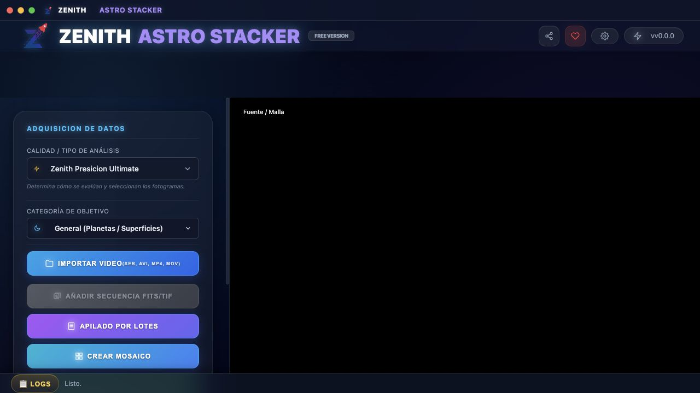
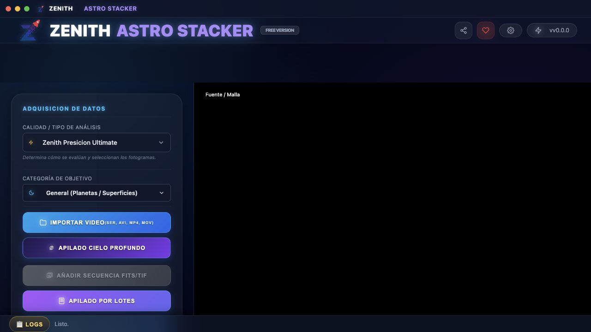
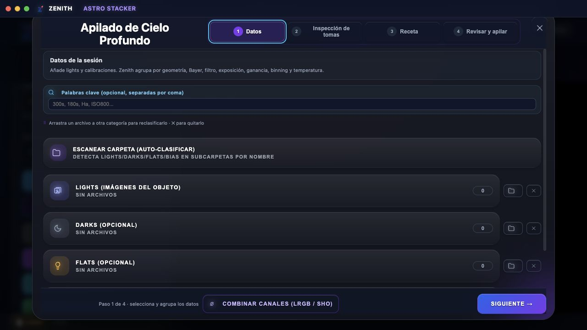
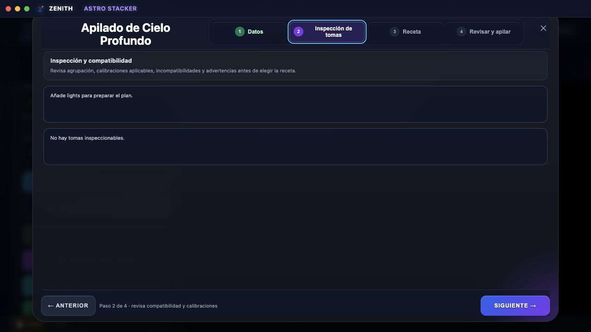
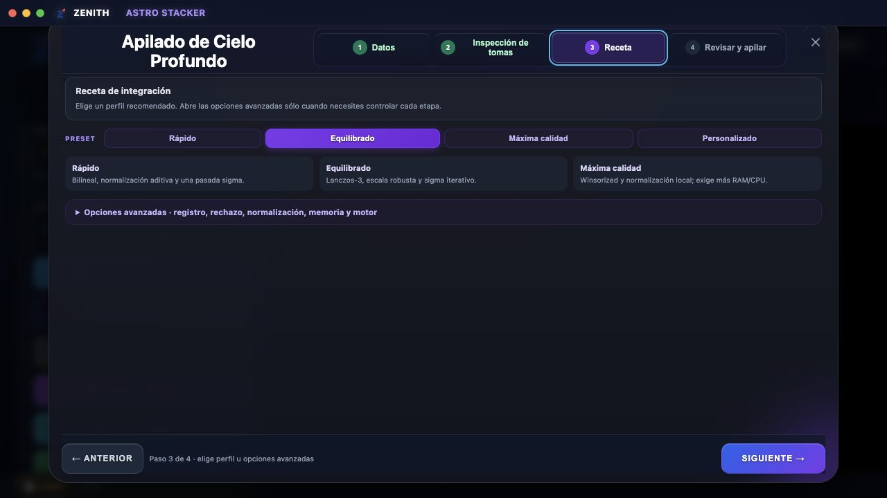
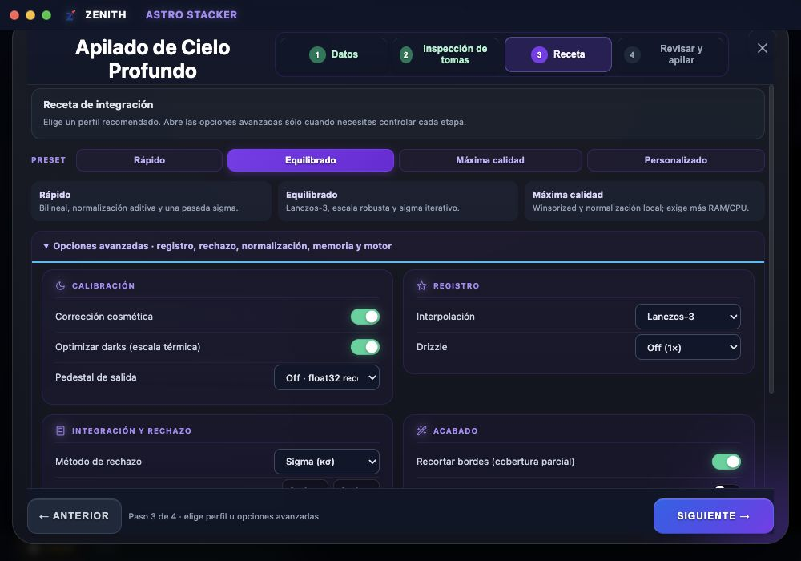
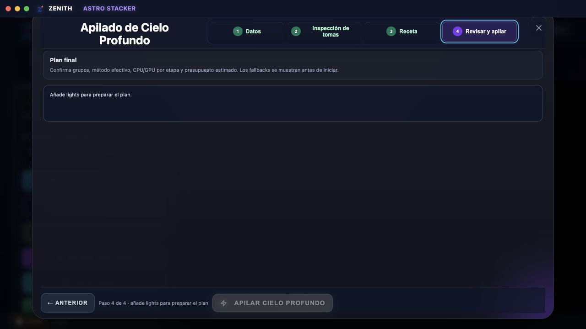
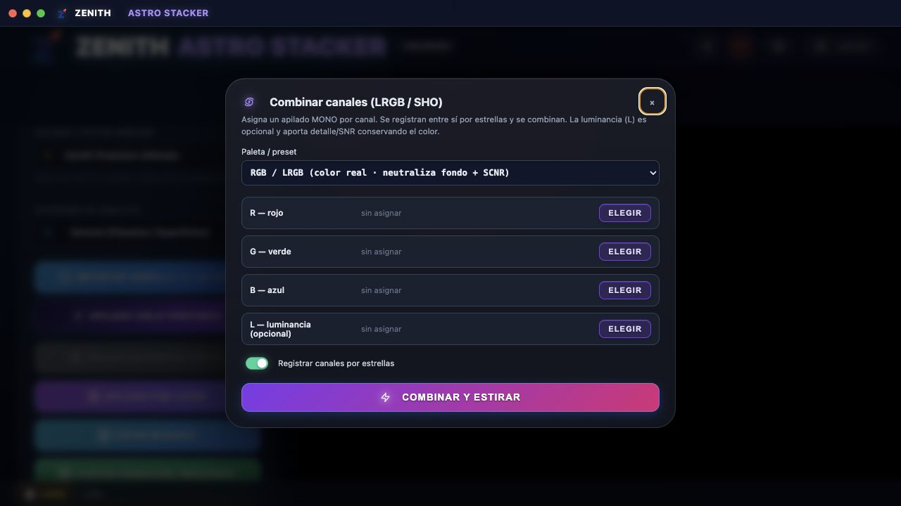
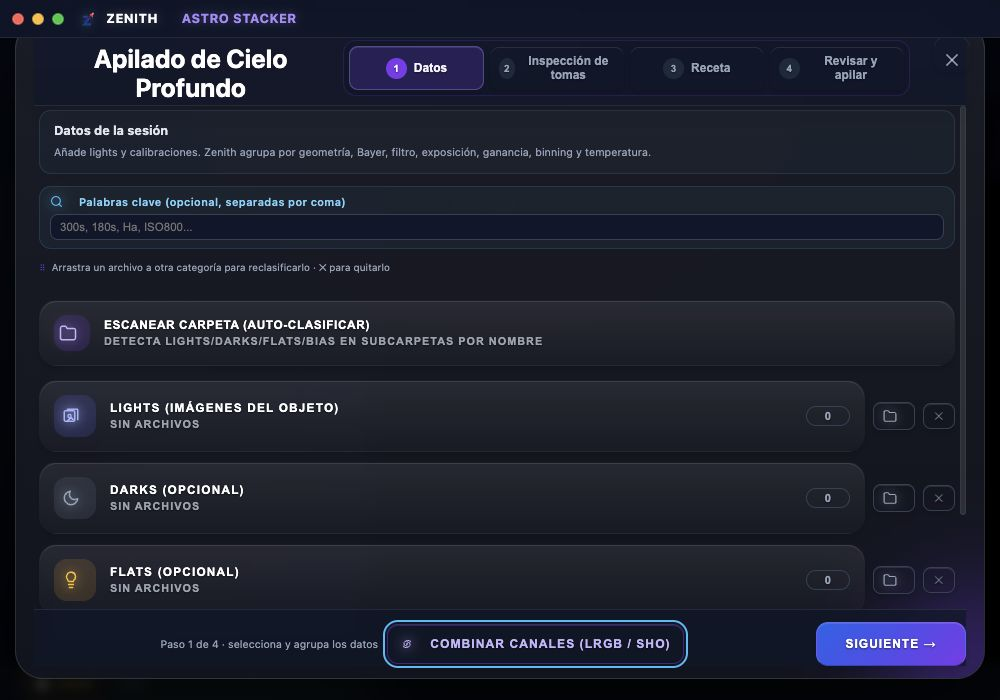

# Auditoría combinada UX y accesibilidad — Hybrid v2

Fecha: 2026-07-10  
Superficie: entrada y asistente de apilado de cielo profundo de Zenith Astro Stacker.  
Objetivo del usuario: seleccionar datos, entender la receta y confirmar el motor real antes de apilar, sin depender de conocimientos internos del backend.  
Objetivo de accesibilidad: navegación completa por teclado, nombres accesibles, foco visible, contraste legible y reflow sin desplazamiento horizontal a 1280×720 y 1000×700.

## Veredicto

El flujo es saludable y coherente con el resto del producto. La auditoría encontró una fricción estructural: la entrada de Cielo Profundo quedaba debajo del primer pliegue a 1280×720. Se corrigió colocándola junto a Importar Video, que son los dos flujos primarios. No se detectaron otros defectos locales que requieran rediseñar el asistente.

La auditoría no demuestra resultados científicos ni tiempos con datos reales. La tabla poblada, la ETA, los fallbacks efectivos, los resultados posapilado y una sesión completa con lector de pantalla siguen necesitando datasets y ejecución Tauri física.

## Recorrido auditado

### 0. Entrada anterior — requiere atención, corregida

La acción de Cielo Profundo no aparecía en el primer viewport de 1280×720 y competía con herramientas secundarias.

### 1. Entrada corregida — saludable

Cielo Profundo aparece inmediatamente después de Importar Video. La prioridad del producto queda clara sin cambiar el lenguaje visual existente.

### 2. Datos — saludable

La explicación, clasificación, grupos y acción principal están juntos. Los controles de carpeta y limpieza tienen nombres accesibles contextuales.

### 3. Inspección de tomas — saludable en estado vacío

El estado vacío explica qué falta y conserva navegación clara. La tabla con PSF, FWHM, ruido y rechazo requiere datos reales para validación visual.

### 4. Receta básica — saludable

Rápido, Equilibrado y Máxima calidad son visibles antes de las opciones expertas. Las descripciones explican el compromiso de cada perfil.

### 5. Receta avanzada — saludable

Registro, rechazo, normalización, acabado y motor permanecen dentro de una sección desplegable. A 1000×700 sólo se desplaza el contenido central.

### 6. Revisar y apilar — saludable en estado vacío

La etapa reserva un único lugar para grupos, método efectivo, CPU/GPU, memoria, disco, tiempo y fallbacks. El botón permanece desactivado sin lights.

### 7. Combinación LRGB/SHO — saludable

El diálogo conserva un propósito único, etiquetas por canal y preset explícito. `Shift+Tab` desde Cerrar envuelve a Combinar y estirar; `Tab` desde la acción final vuelve a Cerrar. Al cerrar, el foco retorna a la acción que abrió el diálogo.

### 8. Datos a 1000×700 — saludable

No hay desplazamiento horizontal. El área central midió 932×503 y su contenido 932×618, confirmando desplazamiento vertical local.

## Accesibilidad confirmada

- Diálogos nombrados mediante `role="dialog"`, `aria-modal` y encabezados asociados.
- Etiquetas reales para campos, presets y selectores.
- Alternativa por teclado al arrastre para reclasificar archivos.
- Trampa circular de foco y retorno de foco al control de origen.
- Contorno visible de 2 px y texto secundario mejorado a `rgb(148, 163, 184)`.
- Sin desbordamiento horizontal a 1000×700.
- Fases y progreso comunicados con semántica de `progressbar` y región viva.

No se afirma conformidad WCAG completa: hace falta probar lector de pantalla, zoom del sistema, selector nativo de archivos y estados con datos reales.

La revisión final también se comprobó a 1000×700 mediante DOM y medidas de
layout. Su captura local se rechazó porque el compositor del navegador guardó
un frame negro pese a mostrar una previsualización correcta; no se usa como
evidencia visual.

## Cambios derivados de la auditoría

1. Se subió Cielo Profundo al bloque primario de entrada.
2. CI ahora ejecuta la suite CPU y sintética en macOS y Windows.
3. Los asistentes de release ejecutan obligatoriamente las 12 pruebas físicas GPU y guardan evidencia verificable; una ejecución con cero pruebas ya no puede aprobar el gate.

## Figma

Se creó [Zenith Astro Stacker — Auditoría Hybrid v2](https://www.figma.com/design/5LRRTxTfdAW2XpXZblp4bl). Las capturas se importaron y se creó la sección de cabecera, pero la cuenta Starter alcanzó el límite de llamadas MCP antes de poder ordenar y anotar todos los frames. Este directorio es la evidencia canónica y completa.

## Evidencia pendiente

- Estado poblado de Inspección y Revisar y apilar.
- Telemetría, cancelación y ETA durante un job real.
- Resultados: máster, rechazo, cobertura y tabla de tomas.
- Lector de pantalla completo.
- Matriz competitiva con datasets, rivales y hardware Windows físico.
