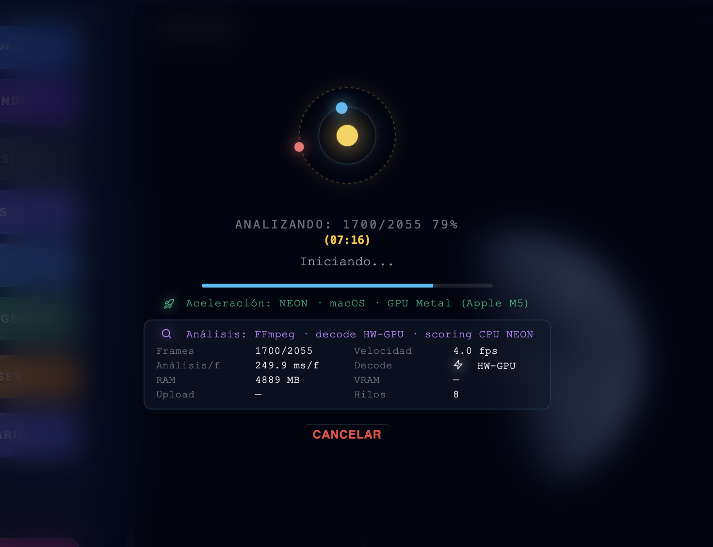
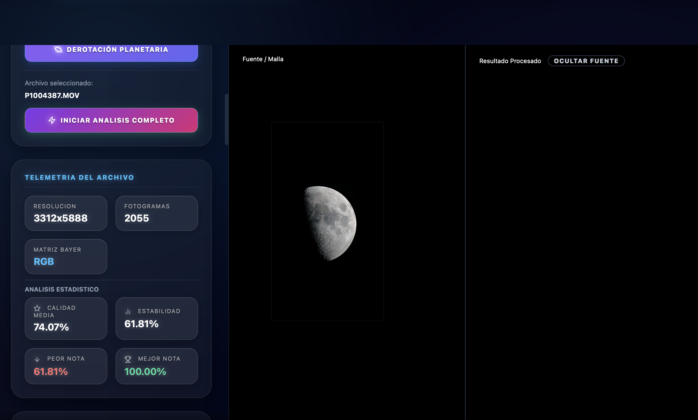

# Auditoría planetaria — GPU, SER y publicación del resultado

Fecha: 2026-07-11  
Equipo verificado: Apple M5, Metal, presupuesto wgpu 2457 MB.

## 1. Análisis FFmpeg — requiere atención (corregido)

La pantalla confirmaba `decode HW-GPU`, pero el cómputo mostraba `scoring CPU
NEON`; VRAM y Upload estaban ocultos durante análisis. No era sólo un problema
visual: Hybrid podía desactivar Metal por comparar una microprueba de un frame,
aunque el camino real procesa lotes y amortiza submit/readback.

Correcciones:

- La UI usa `analyze_planetary` y transmite `ComputePolicy` real.
- Hybrid mantiene el preprocesado Metal por lotes después de validar paridad;
  Auto conserva la decisión adaptativa y GPU-only conserva fallo explícito.
- Telemetría separa `decode_gpu` y `compute_gpu`, y muestra Cómputo, VRAM y
  Upload durante análisis.
- Un fallo operativo GPU queda visible con su motivo y continúa en CPU sólo en
  políticas que permiten fallback.

## 2. Resultado procesado — crítico (corregido)

El backend terminaba correctamente y conservaba el máster como RGB/mono
`u16`, pero la ruta del PNG temporal de visualización se convertía dos veces
con `convertFileSrc`. El WebView recibía una URL de asset inválida y dejaba el
panel de resultado negro.

Correcciones:

- Existe un único punto de conversión de ruta a asset URL.
- `data:`, `asset:`, `blob:` y HTTP(S) ya preparados no se reconvierten.
- La carga fallida del preview ahora produce un error visible; no se presenta
  como apilado exitoso con panel vacío.
- El máster científico permanece en `Vec<u16>`; sólo el preview de pantalla se
  cuantiza a 8 bits para el WebView.

## 3. SER en 0 — requiere atención (corregido y cubierto)

El lector SER sigue siendo nativo/mmap: no existe una fase de decodificación
GPU que acelerar, pero sus frames se agrupan y se envían a Metal para
pirámide, Laplaciano, métricas, CoG, calidad AP y SAD grueso. La CPU conserva
refinamiento y validación.

Correcciones:

- Hybrid también activa GPU en ROI pequeñas; sólo Auto usa el umbral de
  rentabilidad.
- La UI recibe telemetría desde el lote cero y anuncia cuándo llega el primer
  lote SER, evitando una espera muda en 0.
- Prueba nueva valida orden de índices, ROI exacta y muestras SER mono16.

## Verificación

- Frontend Vite: aprobado.
- Rust `cargo check`: aprobado.
- Suite CPU/sintética: 103 aprobadas, 0 fallidas, 12 GPU físicas separadas.
- Suite física Apple Metal: 12/12 aprobadas.
- Paridad planetaria multiframe GPU, SAD GPU y análisis GPU: aprobada.
- Gate `Hybrid v2`: PASS.

La validación final pendiente es reproducir el recorrido con los archivos MOV
y SER reales del usuario para medir throughput y confirmar la publicación del
preview en el WebView de la app instalada.
